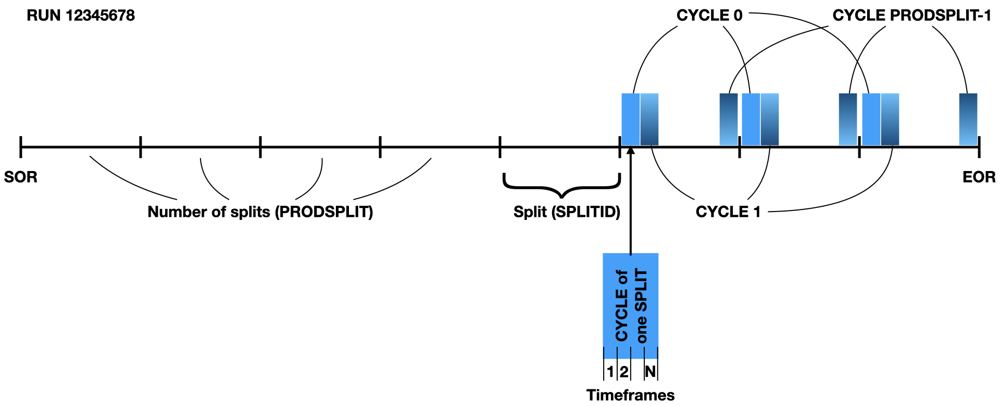
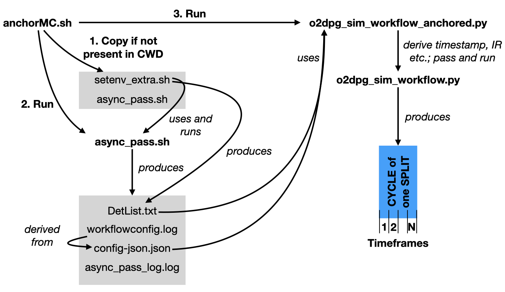

# Anchored MC

**Note** that anchoring MCs are currently not supported on Mac!

## Prerequisites

Please consider installing/loading one of the following `alidist` packages

* `O2sim`,
* `O2PDPSuite`.

These are meta packages which pull everything that is needed.

The steering script for anchored simulations is called [`anchoredMC.sh`](https://github.com/AliceO2Group/O2DPG/blob/master/MC/run/ANCHOR/anchorMC.sh) in O2DPG.
This script respects various environment variables which are also explained in the test scripts (see links [below](#run-an-anchored-simulation)).
Among those, a very useful and powerful one is `ALIEN_JDL_ANCHOR_SIM_OPTIONS` which can be used to add configurations to the creation of the simulation workflow (for a very concrete example see [below](#run-pythia-with-a-different-collision-system)).

**NOTE** that the `anchorMC.sh` is not meant to be changed to introduce different configurations or features. If there is something needed that cannot be achieved with what is explained here, please contact the developers and explain your request.

## Run an anchored simulation

In "anchored" MC simulations, conditions are set to match those during a real data taking run at a given time such as LHC filling scheme, included ALICE detectors, interaction rate etc.
Anchored MC productions are crucial for physics analyses to have realistic simulated samples.

An anchored simulation is bound to a run which is identified by a run number. A run in turn spans from the start-of-run (SOR) to the end-of-run (EOR). This is sketched in the figure.


One anchored simulation run corresponds to one specific `CYCLE` of one `SPLITID` and contains a given number of timeframes as indicated by the big blue box on the bottom right.
A full `RUN` is covered when all `CYCLES` have been produced for all `SPLITIDS`.

There are two examples for anchored simulations:

* [PbPb](https://github.com/AliceO2Group/O2DPG/blob/master/MC/run/ANCHOR/tests/test_anchor_2023_apass2_PbPb.sh),
* [pp](https://github.com/AliceO2Group/O2DPG/blob/master/MC/run/ANCHOR/tests/test_anchor_2023_apass2_pp.sh).

Not done in the scripts above, but a possible way to utilise the environment variable `ALIEN_JDL_ANCHOR_SIM_OPTIONS` could be to run an `external` generator that is configured via an `ini` file. In addition to the other environment variables, one would achieve this with
```bash
export ALIEN_JDL_ANCHOR_SIM_OPTIONS="-gen external -ini <path/to/config.ini>"
```

## Pre- and post-processing steps, special configurations

To add any functionality, required pre- or post-processing steps to your simulation, please do not try to add those by editing core O2DPG scripts or files. There are two specific places where one can add additional functionality or configurations.
Inp articular when preparing production requests and running tests, the official productions cannot run with custom O2DPG scripts.

1. The [`anchorMC.sh`](https://github.com/AliceO2Group/O2DPG/blob/master/MC/run/ANCHOR/anchorMC.sh) steering script should be called inside another shell script where, before or after running `anchorMC.sh`, additional pre- or postprocessing steps can be done.
    * For instance it might be necessary to copy certain files before(after) a simulation from(to) another place.
1. Add specific arguments to be forwarded to the simulation workflow creation via the environment variable `ALIEN_JDL_ANCHOR_SIM_OPTIONS` (see also examples in the sections below).

## Run Pythia with a different collision system

If you need to run Pythia8 with a different collision system than the one during data taking, you can make use of the above method as well.
As a first step, you need to provide your custom `cfg` file for Pythia8. For examples, please have a look [here](https://github.com/AliceO2Group/AliceO2/tree/dev/Generators/share/egconfig).
Then, configure it via
```bash
export ALIEN_JDL_ANCHOR_SIM_OPTIONS="-gen pythia8 -confKey GeneratorPythia8.config=<pth/to/pythia_config.cfg>"
```

Such a configuration can also be build by using the [`mkpy8cfg.py`](https://github.com/AliceO2Group/O2DPG/blob/master/MC/config/common/pythia8/utils/mkpy8cfg.py).
For instance, you could run that first to produce your configuration and pass it on. Here is an example
```bash
${O2DPG_ROOT}/MC/config/common/pythia8/utils/mkpy8cfg.py --output pythia8.cfg --seed 5 --idA 2212 --idB 2212 --eCM 5020 --process jets

# required ALIEN_JDL_* variables
export ALIEN_JDL_ANCHOR_SIM_OPTIONS="-gen pythia8 -confKey GeneratorPythia8.config=$(pwd)/pythia8.cfg"

# the following are example values
export NTIMEFRAMES=2
export NSIGEVENTS=50
export SPLITID=100
export PRODSPLIT=153
export CYCLE=0

# on the GRID, this is set, for our use case, we can mimic any job ID
export ALIEN_PROC_ID=2963436952

# run the central anchor steering script; this includes
# * derive timestamp
# * derive interaction rate
# * extract and prepare configurations (which detectors are contained in the run etc.)
# * run the simulation (and QC)
${O2DPG_ROOT}/MC/run/ANCHOR/anchorMC.sh
```

In addition to the collision system, one can also influence other parameters, like in this case the centre-of-mass energy.

## Environment variables

The `anchorMC.sh` script is sensitive to the following environment variables. Please set/export them, especially in case they are required.

| Variable | Required | Default | Comments |
| -------- | -------- | ------- | -------- |
| `ALIEN_JDL_LPMANCHORPASSNAME` | yes | | |
| `ALIEN_JDL_MCANCHOR` | yes | | |
| `ALIEN_JDL_LPMRUNNUMBER` | yes | | |
| `ALIEN_JDL_LPMANCHORRUN` | yes | | |
| `ALIEN_JDL_LPMPRODUCTIONTAG` | yes | | |
| `ALIEN_JDL_LPMANCHORPRODUCTION` | yes | | |
| `ALIEN_JDL_LPMANCHORYEAR` | yes | | |
| `ALIEN_JDL_LPMPRODUCTIONTYPE` | yes | | Of course, that should be set to `MC`. At the  moment, it is still required to be set, but it is foreseen to set this to `MC` by default and remove it from even being configurable. |
| `ALIEN_JDL_LPMINTERACTIONTYPE` | yes | | The interaction type, choose from `pp` or `PbPb` |
| `ALIEN_JDL_CPULIMIT` | no | 8 | The CPU limit that will be **assumed** by the workflow runner. The real limit depends on the machine it is run on. |
| `ALIEN_JDL_SIMENGINE` | no | `TGeant4` | The engine to be used for particle transport. |
| `ALIEN_JDL_WORKFLOWDETECTORS` | no | `ITS,TPC,TOF,FV0,FT0,FDD,MID,MFT,MCH,TRD,EMC,PHS,CPV,HMP,CTP` | This can be a subset of the detectors that were active in reconstruction. If any detector is given here that was not active in reconstruction, it will be ignored. |
| `ALIEN_JDL_ANCHOR_SIM_OPTIONS` | no | *empty* | Any additional simulation options to allow custom user setting. See [example](#run-pythia-with-a-different-collision-system) above. |
| `ALIEN_JDL_ADDTIMESERIESINMC` | no | `1` | Whether or not to run TPC time series. Set to `0` to disable. |
| `ALIEN_JDL_MC_ORBITS_PER_TF` | no | *empty* | Set the length of a timeframe in orbits (Otherwise the GRPECS value is used). |
| `ALIEN_JDL_RUN_TIME_SPAN_FILE` | no | *empty* | Set the filename containing bad/good data taking periods. (Same as in async reco). |
| `ALIEN_JDL_INVERT_IRFRAME_SELECTION` | no | *empty* | If set, inverts the selection of the ALIEN_JDL_RUN_TIME_SPAN_FILE file. |
| `ALIEN_JDL_O2DPGWORKFLOWTARGET` | no | "aod" | Sets the target task, up which the O2DPG MC workflow is to be run. See workflow.json for the tasks. |
| `ALIEN_JDL_O2DPG_ASYNC_RECO_TAG` | no | *empty* | Software package (e.g., O2PDPSuite::async-async-20240229.pp.2b-slc9-alidist-O2PDPSuite-daily-20231208-0100-async1-1) used to run reconstruction steps and configuration setup. |
| `ALIEN_JDL_CCDB_CONDITION_NOT_AFTER` | no | *empty* | sets the condition_not_after timestamp for CCDB queries (to force fetching objects with a state before that timestamp). |
| `SEED` | no | `${ALIEN_PROC_ID:-1}` | Set to seed the simulation. |
| `SPLITID` | yes | | Choose the split to be simulated. See [terminology](#run-an-anchored-simulation) above. |
| `PRODSPLIT` | yes | | Choose the maximum number of splits. See [terminology](#run-an-anchored-simulation) above. |
| `CYCLE` | yes | | Choose the cycle within which to simulated. See [terminology](#run-an-anchored-simulation) above. |
| `NTIMEFRAMES` | yes | | The number of timeframes to be simulated for this split. |
| `NSIGEVENTS` | yes | | The number of signal events to be simulated per timeframe. Note that this is treated as an upper limit. The actual number of events is re-computed based in the interaction rate determined for this split. |

## Behind the scenes

The procedure steered behind the scenes is quite involved. The following figure shall provide some overview.



## The 2-Software Tag Approach for Anchored MC Productions

A **2-tag software approach** is supported for anchored Monte Carlo (MC) productions. This means that individual tasks within an MC job can run using different CVMFS software releases.

### Motivation

The key motivation is to allow **reconstruction algorithms** to run against **stable releases** and configurations—those also used in data-reconstruction passes. At the same time, it is beneficial to **pick up new developments** in:

- Event generators  
- GEANT-based simulation  
- Generic anchoring logic  
- Workflow execution infrastructure

This approach reduces the need to backport improvements into older software releases.

---

### How to Use the 2-Tag Setup

In practice, you only need to do the following:

**(a)** Use a recent (validated) software release in the `Packages` field of your JDL:

- Picks up the latest **O2DPG logic**
- Uses the most recent **generator code**
- Includes updated **GEANT and digitization algorithms**

**(b)** Set the environment variable `ALIEN_JDL_O2DPG_ASYNC_RECO_TAG` to point to the release used for **reconstruction**.

- Ensures reconstruction uses the correct version for anchoring and configuration

---

### Example JDL Snippet

```jdl
Packages = {
  "VO_ALICE@O2PDPSuite::daily-20250408-0000-1"
};

JDLVariables = {
  ...
  O2DPG_ASYNC_RECO_TAG
  ...
};

O2DPG_ASYNC_RECO_TAG = "VO_ALICE@O2PDPSuite::async-async-v1-02-10-slc9-alidist-async-v1-02-01-1"
...
```

### Important Notes

While this approach is powerful and convenient, it comes with **potential risks**:

* Incompatibilities between the two software releases (e.g., data format, configuration options, etc.)
    
* These should be **tested in pilot jobs** before launching large-scale productions.
    

Any observed issues should be reported via the usual channels:

* [Mattermost simulation channels]
    
* [JIRA tickets]
    
